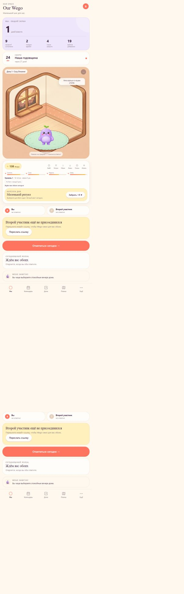
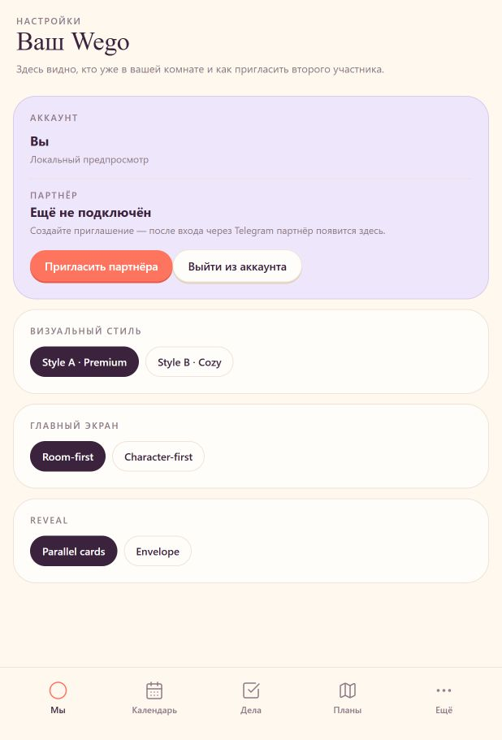

# WEGO UX-аудит

Дата: 2026-09-16  
Поверхность: опубликованная GitHub Pages-версия `https://elazazel.github.io/WEGO/`  
Проверенный сценарий: главный экран → доступ к аккаунту и приглашение партнёра.

## Итог

Визуальный язык цельный: тёплая палитра, персонаж и комната хорошо объясняют идею продукта. Главный риск был функциональным: опубликованная сборка показывала локальный demo и не давала пользователю понять, что аккаунт и пара ещё не подключены к серверу. В коде это исправлено: production без `WEGO_API_URL` теперь не запускает demo-данные, а показывает явный экран настройки backend.

## Шаги и состояние

1. **Главный экран — частично здоров.** Комната и состояние Wego заметны сразу; статус второго участника читается. Но аватар в шапке до исправления был декоративным и не открывал аккаунт. Добавлена доступная кнопка «Открыть аккаунт».

   

2. **Экран аккаунта и партнёра — частично здоров.** Экран уже содержит Telegram-аккаунт, статус партнёра, создание инвайта и выход. На снимке он явно показывает «Локальный предпросмотр», поэтому до настройки API это не настоящий аккаунт. После подключения API этот статус заменяется серверной сессией и реальными данными пространства.

   

## UX и accessibility-наблюдения

- Кнопка аккаунта теперь имеет имя для screen reader и видимый focus-ring.
- Приглашение партнёра остаётся основным действием в состоянии без пары; deep-link ведёт через `wego_app_bot`.
- Состояние «backend не подключён» теперь должно быть явным, а не маскироваться демо-данными.
- По скриншотам нельзя подтвердить Telegram-auth, межустройственную синхронизацию, SSE, ошибки сети и реальное принятие invite. Это требует подключённого production API и проверки двумя Telegram-аккаунтами.
- Снимок полного документа показал повтор нижнего блока из-за фиксированной навигации в режиме full-page capture; в обычном viewport он не дублируется. Это ограничение метода захвата, а не подтверждённая ошибка пользовательского viewport.

## Критический release blocker

Для настоящего запуска нужны production API и PostgreSQL. Репозиторий уже содержит сервер, миграции, Telegram-подпись init data, сессии, invite flow и защиту reward-лимитов. Но GitHub Pages не запускает `apps/api`, поэтому без значения `WEGO_API_URL` нельзя честно заявить, что Telegram-пользователи видят общий аккаунт и партнёра.
